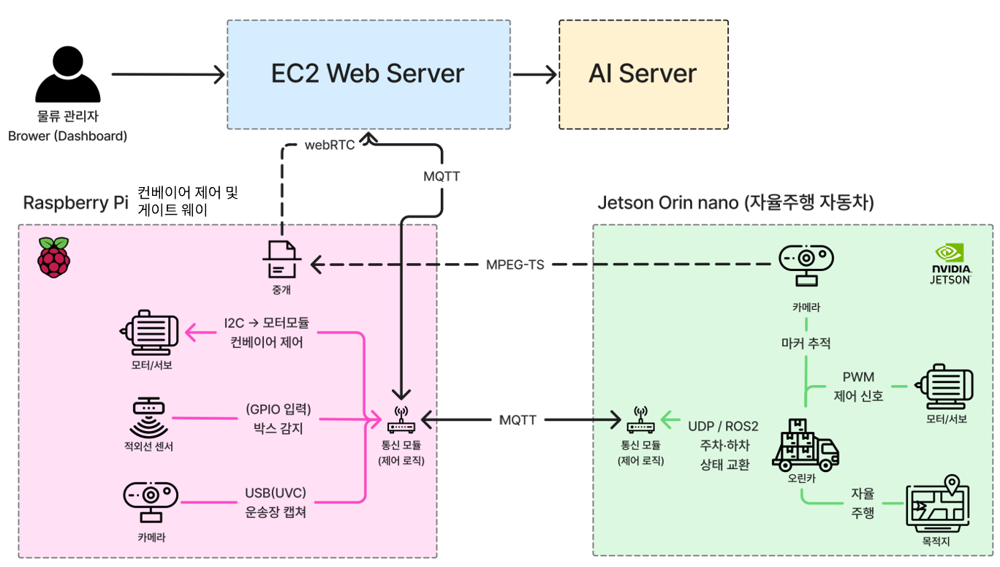
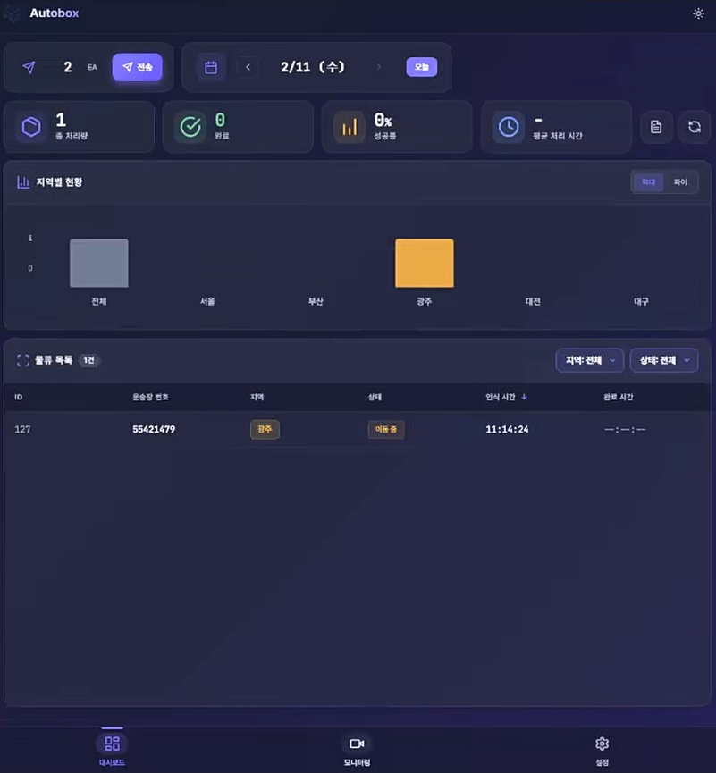
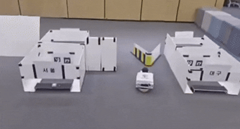

## 📚 목차

> 클릭시 해당 섹션으로 바로가기

- [🏭 물류 자동화 시스템](#-물류-자동화-시스템)
- [🛠 기술 스택 (Tech Stack)](#-기술-스택-tech-stack)
- [🏗 시스템 아키텍처 및 역할 (System Architecture)](#-시스템-아키텍처--및-역할-system-architecture)
- [🎬 프로젝트 시연](#프로젝트-시연)
- [📋 프로젝트 기여 및 역할](#-프로젝트-기여-및-역할)
- [**🛠 주요 기술 상세**](#-주요-기술-상세)
  - 🐳 Docker Compose
  - 🛡️ 시스템 보안
  - 🎥 미디어 스트리밍 — MPEG-TS → WebRTC 중계
  - 📟 Edge 미들웨어 — MQTT 게이트웨이
  - ⚙️ 컨베이어 벨트 제어 — I2C 모터 + GPIO 센서
- [🔧 Troubleshooting(docker pid1 문제)](#-트러블슈팅)
- [📂 리포지토리 구조 (Repository Context)](#-리포지토리-구조-repository-context)

---

# 🏭 물류 자동화 시스템

> **공장 물류시스템 (클라우드-엣지-엔드 디바이스) 자동화 시스템**

- 웹 대시보드 기반 공장 관제
- 라즈베리파이의 게이트웨이,미들웨어 역할 및 컨베이어 벨트 제어
- RC카(Jetson Orin Nano)의 자율주행 이동 및 하역

---

## 🛠 기술 스택 (Tech Stack)

### Embedded & Hardware

   

### Infrastructure & DevOps

   

### Communication

    

---

## 🏗 시스템 아키텍처  및 역할 (System Architecture)

본 시스템은 **3계층, 폐쇄망 구조** 로 설계되었습니다.



<details>
<summary> 📚 각 계층별 역할 및 기능 </summary>

### 1. Cloud

> 전체 시스템의 중앙 관제 및 데이터 분석을 담당합니다.

- **Web Server**: 관리자가 접속하는 대시보드 인터페이스 제공. 하위 노드 데이터, 상태 시각화.
- **AI Server**: 운송장 OCR 수행.
- **Communication**: MQTT 브로커 서버역할 수행. 제어명렁 전송, 텔레메트리 데이터 수신.

### 2. Raspberry Pi

> 컨베이어 벨트 제어와 게이트웨이를 담당하는 **에지 컴퓨팅 노드**입니다.

- **Hardware Control**:

  - `Motor/Servo`: I2C 통신을 통한 컨베이어 벨트 구동.
  - `IR Sensor`: 적외선 센서 입력을 통한 실시간 박스 감지.
  - `USB Camera`: 운송장 정보 캡처
- **Communication & Logic**:

  - **pi <-> server**: 시스템 제어 명령 수신 및 텔레메트리 데이터,운송장 데이터 전송.
  - **pi <-> jetson**: 로컬 네트워크에서 브로커역할 수행.  텔레메트리 데이터 수신 및 제어 명령 전송.
  - **WebRTC & MPEG-TS**: 중계 서버역할.Jetson(이동체)으로부터 전달받은 주행 영상을 수신 및 중계.

### 3. Jetson Orin Nano

> 자율 주행 및 하역을 담당하는 **이동형 로봇 노드**입니다.

- **Hardware & Vision**

  - `Camera`: 마커 추적(Marker Tracking)을 통한 정밀 위치 인식.
  - `Motor/Servo`: PWM 제어 신호를 통한 차량 주행/조향 제어.
  - **Autonomous Driving**: ROS2를 활용한 지정된 목적지로의 경로 계획 및 자율 주행 로직 수행.
- **Communication**:

  - **MQTT**: RPi의 통신 모듈과 연동되어 전체 시스템 상태 동기화.
  - **MPEG-TS (Sender)**: 주행 카메라 영상(전/후방)을 RPi로 실시간 전송.

</details>

---

## 프로젝트 시연

<details>
<summary> 시연 이미지 </summary>

> **웹 대시보드(전체 현황)**
> 

> **웹 대시보드(이동경로, 스트리밍 영상,텔레메트리 데이터)**
> 

> **컨베이어 벨트 이동 및 센서 감지**
> 

> **컨베이어 벨트 - RC 카 상차**
> 

> **장애물 회피**
> 

> **RC 카 주차**
> 

</details>

---

## 📋 프로젝트 기여 및 역할

저는 본 프로젝트에서 **시스템 아키텍처 설계, 통신 인프라 구축, 컨베이어 제어 로직**을 전담하였습니다.

<details>
<summary> 🛠 담당 상세 내용 </summary>

| 구분                | 담당 및 기여 내용                                                                                                                 | 주요 기술                                    |
| :------------------ | :-------------------------------------------------------------------------------------------------------------------------------- | :------------------------------------------- |
| **아키텍처 설계**   | 3계층 폐쇄망 아키텍처 설계 (Cloud ↔ Edge ↔ End-device). VPN 가상망과 로컬 LAN을 동시 운용하는**Sidecar Gateway 패턴** 적용        | `Tailscale`, `Docker`                        |
| **시스템 보안**     | 외부망(Cloud↔Edge)**mTLS 상호 인증** +  내부망(Edge↔Device) **ID/PW 인증** 적용, VPN 기반 폐쇄망 구축                             | `OpenSSL`, `Tailscale`                       |
| **미디어 스트리밍** | RPi 중계 서버 기반 영상 파이프라인 구축: Jetson →{MPEG-TS/UDP}→ RPi →{WebRTC}→ Web. Nginx 리버스 프록시로 WHEP 세션 처리          | `MediaMTX`, `WebRTC`, `MPEG-TS`,`Nginx`      |
| **DevOps**          | Tailscale 컨테이너를 Gateway Router로 사용하는 Sidecar 패턴 Docker Compose 오케스트레이션. 듀얼스택(VPN+LAN) 라우팅 스크립트 작성 | `Docker Compose`, `iptables`, `Shell Script` |
| **Edge 미들웨어**   | 로컬 MQTT 브로커 + 서버 MQTT 클라이언트 이중 구조의 게이트웨이 통신 모듈 개발. 팩토리 상태 머신 기반 공정 제어 로직 구현          | `MQTT`                                       |
| **컨베이어 제어**   | I2C 통신 기반 DC모터/서보모터 제어, IR센서 인터럽트 감지, 삼색 LED 상태 표시. GPIO 콜백 기반 비동기 박스 감지                     | `RPi.GPIO`, `I2C`                            |

</details>

---

## 🛠 주요 기술 상세

<details>
<summary> 🐳 Docker Compose </summary>

### 주요사항

Tailscale VPN을 호스트 OS에 직접 설치하면 호스트 환경이 오염됨. 그러나 컨테이너에 가두면 VPN과 LAN트래픽이 충돌했음.

### 방식

Tailscale 컨테이너를 네트워크 Gateway역할로 설정하고 라우팅 스크립트를 작성하여, 나머지 모든 서비스를 `network_mode: service:tailscale`로 네트워크를 공유하여 병합.

```
┌────────────────────────────────────────────────────┐
│          docker  Network                           │
│  ┌───────────┐ ┌──────────┐ ┌──────────┐ ┌─────┐   │
│  │ tailscale │ │mosquitto │ │mediamtx  │ │ app │   │
│  │ (Router)  │ │ :1883    │ │ :8889    │ │     │   │
│  └─────┬─────┘ └──────────┘ └──────────┘ └─────┘   │
│    tun0│  eth0                                     │
└────────┼────┼──────────────────────────────────────┘
         │    │
    VPN  │    │ LAN
  100.x.x│    │192.168.x.x
         ▼    ▼
      EC2    RC카(Jetson)
```

- **`routing.sh`**: 컨테이너 부팅 시 로컬 네트워크를 Docker 브리지(eth0)로 고정하여, VPN 터널(tun0)로 LAN 패킷이 유실되는 것을 방지
- **`--netfilter-mode=off`**: Tailscale이 Docker의 기본 iptables 규칙을 덮어쓰지 않도록 설정하여 컨테이너 간 통신 및 포트 포워딩 무결성 유지

> 클릭시 파일로 바로가기

- [도커 컴포즈 파일](./rasberry_pi/docker-compose.yml)
- [라우팅 스크립트](./rasberry_pi/routing.sh)

</details>

<details>
<summary> 🔒 시스템 보안 </summary>

### 주요사항

엣지 디바이스의 보안과 빠른 통신 및 전력 효율 고려해야함

### 방식

엣지 디바이스는 로컬 네트워크로만 통신하며 최소한의 보안장치(비밀번호 인증)를 적용한다.
엣지디바이스와 서버와 통신은 라즈베리파이가 중재하는 mTLS 상호 인증을 통해 이루어진다.

> tailscale의 wireguard (UDP기반 터널링 프로토콜)를 이용한 가상화 터널을 만들 경우
> 적은 오버헤드(약60바이트)로 openvpn과 다르게 빠른 통신이
> 가능하여 보안과 효율을 동시에 챙길 수 있습니다.

```
        vpn(mTLS)      lan(PW인증)
     ec2 <────> rasberry <────> jetson
      └─────────────┼──────────────┘
          라즈베리파이가 데이터 중계
```

### 외부망 (Cloud ↔ Edge)

- **mTLS 상호 인증**: CA 인증서 + 클라이언트 인증서/키를 통한 양방향 TLS 인증
- **Tailscale VPN**: 100.x.x.x 대역의 폐쇄형 가상 네트워크로 공인망 노출 차단
- **MQTT (8883)**: 암호화된 채널로 텔레메트리/제어 명령 송수신

### 내부망 (Edge ↔ Device)

- **`allow_anonymous false`**:비밀번호를 통한 접근 제어로 최소한의 보안 유지

> 클릭시 파일로 바로가기

- [서버 mqtt 설정파일](./back/mqtt/config/mosquitto.conf)
- [엣지 mqtt 설정파일](./rasberry_pi/mosquitto.conf)

</details>

<details>
<summary> 🎥 미디어 스트리밍 — MPEG-TS → WebRTC 중계 </summary>

### 주요사항

WebRTC는 P2P 방식. 관제 노드와 엔드 디바이스 노드가 직접 연결되어야하지만,
엔드 디바이스의 ip를 노출하고, 엔드 디바이스에게 가상ip를 부여하는것은 위험할 수 있음.

### 방식

중재 노드(라즈베리파이)가 중재하는 WebRTC를 통해 이루어진다.

### 파이프라인

```
Jetson (LAN)              RPi (Edge)               Web (Cloud)
┌───────────┐  MPEG-TS   ┌──────────┐   WebRTC    ┌──────────┐
│ GStreamer │ ──:5000──→ │ MediaMTX │ ──:8889───→ │  Browser │
│           │            │  Relay   │             │          │
└───────────┘            └──────────┘             └──────────┘
                                          ↑
                                 Nginx Reverse Proxy
                                   DNS(ec2)/stream/ → :8889
```

- **Jetson → RPi**: GStreamer로 인코딩한 영상을 MPEG-TS/UDP로 로컬 네트워크(192.168.x.x:5000) 전송
- **RPi (MediaMTX)**: UDP 수신 → WebRTC(WHEP) 프로토콜로 변환하여 Tailscale VPN IP로 스트리밍
- **Nginx**: `/stream/` 경로로 WebRTC 시그널링을 리버스 프록시하여 프론트엔드에서 접근 가능하게 처리

> 클릭시 파일로 바로가기

- [젯슨 스트리밍 객체](./jetson/src/cam_lib.py)
- [라즈베리파이 MediaMTX 설정](./rasberry_pi/mediamtx.yml)
- [nginx 설정](./front/nginx.conf)

</details>

<details>
<summary> 📡 Edge 미들웨어 — MQTT 게이트웨이 </summary>

### 구조

```
          ┌──────── server_Network ────────┐
          │  TLS/mTLS → 100.x.x.x:8883     │
          │  토픽: server_msg/+/+          │
EC2 ◄─────┤  토픽: factory_msg/+/+         ├─────────► app (state machine)
          └────────────────────────────────┘
                                                         │
          ┌──────── local_Network ─────────┐             │
          │  localhost:1883 (ID/PW 인증)    │            │
          │  토픽: edge_msg/+/+             │            │
RC카 ◄────┤  토픽: factory_msg/+/+          ├────────────┘
          └────────────────────────────────┘
```

- **`server_Network`**: EC2의 MQTT 브로커(8883/TLS)와 연결. 서버 명령 수신 + 텔레메트리/운송장 이미지 전송
- **`local_Network`**: 로컬 Mosquitto 브로커(1883)와 연결. RC카 등 엣지 디바이스 상태 수신 + 제어 명령 전송
- **브릿지 역할**: 로컬 디바이스의 상태 데이터를 서버로 중계 (`edge_msg → factory_msg`)

> 클릭시 파일로 바로가기

- [통신 객체 라이브러리](./rasberry_pi/app/network_manager.py)

</details>

<details>
<summary> ⚙️ 컨베이어 벨트 제어 — I2C 모터 + GPIO 센서 </summary>

### 주요사항

컨베이어 벨트는 DC모터, 서보모터, IR센서, 삼색 LED 등 다수의 하드웨어를 동시에 제어해야 하며, 센서 감지 시 즉각적인 반응(모터 정지)이 필요함.

### 방식

`threading.Event` 기반의 비동기 아키텍처를 적용하여 벨트 구동과 센서 감지를 병렬 처리. GPIO 인터럽트 콜백으로 실시간 박스 감지 후 이벤트 플래그를 통해 모터 스레드에 정지 신호를 전달함.

### GPIO

```
 Raspi_MotorHAT (I2C: 0x6f)
 ┌───────────────────────────────────────────┐
 │  DC Motor (CH2)     Servo (CH0, CH1)      │
 │  ┌───────────┐      ┌───────────────┐     │
 │  │ 벨트 구동  │      │ 박스 Push/Pull│     │
 │  │ Speed: 80 │      │ Smooth Move   │     │
 │  └─────┬─────┘      └──────┬────────┘     │
 └────────┼────────────────────┼─────────────┘
          │                    │
          ▼                    ▼
     컨베이어 벨트          적재 서보암


 입출력
 ┌──────────────────────────────────────────────┐
 │  IR Sensor (PIN 17)    RGB LED (23,24,25)    │
 │  ┌──────────────┐      ┌──────────────┐      │
 │  │ FALLING Edge │      │ 🟢 대기      │      │
 │  │ Callback     │      │ 🔴 벨트 가동 │      │
 │  │ Bounce: 200ms│      │ 🔵 촬영/적재 │      │
 │  └──────────────┘      └──────────────┘      │
 └──────────────────────────────────────────────┘

```

### 공정 흐름 (상태 머신)

```
  서버 명령 수신 (box_count ≥ 1)
         │
         ▼
  ① 벨트 가동 (DC Motor FORWARD) ─── 🔴 LED
         │                              ╔══════════════════════╗
         ▼                              ║   리셋 트리거 발생    ║
  ② IR 센서 감지 → 벨트 정지             ║  state.reset = True  ║
         │                              ╚══════════╤═══════════╝
         ▼                                         │
  ③ 카메라 촬영 & 운송장 전송 ── 🔵 LED             │ check_reset()
         │                                         │
         ▼                                         ▼
  ④ RC카 호출 → 주차 완료 대기             raise SystemReset(!)
         │                                         │
         ▼                                    ┌────┴────┐
  ⑤ 서보암 Push → 박스 적재 ── 🔴 LED          │ except  │
         │                                    │ handler │
         ▼                                    └────┬────┘
  ⑥ RC카 목적지 출발 명령                          │
         │                              ┌──────────┴──────────┐
         ▼                              │ emergency_stop()    │
  ⑦ 사이클 완료 ── 🟢 LED               │ state.reset_all()   │
         │                              └──────────┬──────────┘
         ▼                                         │
        ① 복귀 ◄───────────────────────────────────┘
```

### 핵심 구현

- **비동기 벨트 제어**:`threading.Thread`로 모터를 구동하고,`threading.Event`로 센서 감지 시 즉시 정지. 안전장치로 15초 타임아웃 적용
- **GPIO 인터럽트 콜백**:`GPIO.add_event_detect(FALLING)`으로 IR센서 하강 에지 감지,`bouncetime=200ms`로 채터링 방지
- **비상 정지**:`emergency_stop()` 호출 시 모터 즉시 해제 + 서보 원위치 복귀 + 상태 초기화
- **자원 정리**:`cleanup()` 시 모터 해제 → 이벤트 플래그 설정 → LED 소등 →`GPIO.cleanup()` 순차 실행
- **예외 처리** : 커스텀 예외(`SystemReset`)를 활용한 체크포인트 패턴, 매 단계별 동작마다 체크포인트 설정하여 콜스택 깊이와 무관하게 한 번의`raise`로 최상위`try-except` 핸들러까지 즉시 탈출

> 클릭시 파일로 바로가기

- [메인 상태 머신 (예외 처리 로직)](./rasberry_pi/app/main.py)
- [컨베이어 제어 라이브러리 (emergency_stop / cleanup)](./rasberry_pi/app/conveyer_control.py)
- [상태 관리 모듈 (reset_all)](./rasberry_pi/app/state.py)

</details>

---

## 트러블슈팅

<details>
<summary> Docker 환경 내 GPIO 제어 앱 고아(Orphan) 프로세스,자원 경합 문제 </summary>

## 문제 상황 (Problem)

### 비정기적으로 적외선센서가 입력을 받지 못하는 현상이 발생함.

도커(Docker) 기반의 임베디드 기기 환경에서 파이썬 컨베이어 제어 애플리케이션을 구동하던 중,
컨테이너 종료(docker compose down) 후에도 프로세스가 완전히 종료되지 않고 고아 프로세스(Orphan Process)로 남아 하드웨어 제어권을 쥐고 있는 현상이 발생함.

이로 인해 컨테이너를 재시작했을 때, 여전히 살아있는 고아 프로세스와 새로 띄운 프로세스 간에 GPIO 입력값을 두고 경쟁 상태(Race Condition) 가 발생함. (※ GPIO 제어 자체는 한 프로세스에 배타적이지 않으며, 먼저 읽는 프로세스가 값을 가져가는 구조라 제어 명령이 무시되거나 오작동하는 치명적인 문제가 발생함)

## 원인 분석 (Root Cause)

해당 문제는 도커 컨테이너 내부의 프로세스 관리(PID) 특성과 예외 처리가 맞물려 발생함.

### PID 1 프로세스와 Signal 처리 한계

- 도커 격리 환경 내에서 파이썬 제어 앱이 PID 1을 할당받아 실행됨.
- docker compose down 실행 시 도커 데몬은 모든 프로세스에 정상 종료 신호인 SIGTERM을 보냄.
- 하지만 리눅스 커널 특성상 PID 1은 명시적인 시그널 핸들러가 없으면 기본적으로 SIGTERM을 무시함.
- 그에 반해, 나머지 프로세스는 종료까지 지속적으로 SIGTERM 신호를 받고 종료를 수행함.

### 강제 종료(SIGKILL)와 Cleanup 누락

- SIGTERM에 반응하지 않자, 도커는 프로세스를 완전히 종료시키기 위해 SIGKILL을 날리고 컨테이너를 down 완료 상태로 처리함.
- 하지만 하드웨어(GPIO)를 제어하고 있는 특수한 상황에서, 정상적인 자원 반환(GPIO.cleanup()) 로직을 수행하지 못함.

### 고아 프로세스의 발생

결과적으로 부모 프로세스가 종료된 채 실행되는 고아 프로세스(Orphan Process) 가 됨.
(참고: 죽고 싶어도 부모 프로세스가 허락 명령을 못 보내는 상태는 '좀비(Zombie) 프로세스'이며, 이 상황은 부모가 먼저 죽어버려 계속 동작하는 '고아 프로세스' 현상임)

## 해결 (Solution)

### 해결 방안

- 파이썬 앱이 직접 PID 1이 되는 것을 방지하기 위해 가벼운 init 시스템(dumb-init 또는 tini)을 적용.
- docker-compose.yml 파일에 init: true 옵션을 추가하여 운영체제의 시그널 라우팅 정상화.

### 실제 해결

- docker-compose.yml 컨테이너에 tailspin 컨테이너를 추가하면서 depends_on 옵션때문에
  자연스럽게 PID 1문제가 사라짐

</details>

---

## 📂 리포지토리 구조 (Repository Context)

본 리포지토리에는 제가 담당한 **네트워크, 통신 및 제어 코드**만 저장되어 있습니다.

<details>
<summary> 📂 리포지토리 구조 (Repository Context) </summary>


```bash
프로젝트 디렉토리

📦 Project Root
 ┃
 ┣ 💻 rasberry_pi 
 ┃  ┣ 📂 app/
 ┃  ┃  ┣ 📜 Dockerfile           # 도커 컨테이너 설정파일
 ┃  ┃  ┣ 📜 main.py              # 시스템 전체 상태 머신
 ┃  ┃  ┣ 📜 conveyer_control.py  # 컨베이어 모터/센서 제어 라이브러리
 ┃  ┃  ┣ 📜 network_manager.py   # MQTT 통신, 데이터 처리 라이브러리 
 ┃  ┃  ┣ 📜 conveyer_belt_cam.py # 컨베이어 벨트 카메라 제어 라이브러리
 ┃  ┃  ┣ 📜 state.py             # 컨베이어 상태 관리 라이브러리
 ┃  ┃  ┣ 📜 requirements.txt     # 패키지 설치 파일 
 ┃  ┃  ┣ 📜 Raspi_*.py           # 모터제어 관련 외부 라이브러리
 ┃  ┃  ┗ 📜 .env                # 환경 변수 설정
 ┃  ┣ 📂 certs/
 ┃  ┃  ┣ 📜 ca.crt               # 외부 접속을 위한 CA 인증서
 ┃  ┃  ┣ 📜 client.crt           # 외부 접속을 위한 클라이언트 인증서
 ┃  ┃  ┗ 📜 passwd               # MQTT 브로커 비밀번호 파일
 ┃  ┃
 ┃  ┣ 📜 mosquitto.conf          # MQTT 브로커 설정파일
 ┃  ┣ 📜 docker-compose.yml       # 도커 컨테이너 오케스트레이션
 ┃  ┣ 📜 mediamtx.yml             # WebRTC/MPEG-TS 스트리밍 설정
 ┃  ┗ 📜 routing.sh               # VPN-LAN 이중 경로 라우팅 스크립트
 ┃
 ┣ 💻 EC2 서버 
 ┃ ┣ 📂 back/                     # 백엔드 & 클라우드 통신
 ┃ ┃ ┣ 📂 mqtt  
 ┃ ┃ ┃ ┣ 📂 config
 ┃ ┃ ┃ ┃ ┗ 📜 mosquitto.conf      # MQTT 브로커 설정파일
 ┃ ┃ ┃ ┣ 📂 certs/
 ┃ ┃ ┃ ┃   ┣ 📜 ca.crt            # 외부 접속을 위한 CA 인증서
 ┃ ┃ ┃ ┃   ┗ 📜 server.crt        # 외부 접속을 위한 서버 인증서
 ┃ ┃ ┃ ┗ 📜 mqtt.py               # 라즈베리파이 통신 및 데이터 처리
 ┃ ┃ ┣ 📜 Dockerfile              # 백엔드 컨테이너 설정파일
 ┃ ┃ ┗ 📜 docker-compose.yml      # 서버 인프라 오케스트레이션
 ┃ ┣ 📂 front/                    # 프론트엔드 배포 설정
 ┃ ┃ ┣ 📜 Dockerfile              # 프론트엔드 컨테이너 설정파일
 ┃ ┃ ┗ 📜 nginx.conf              # WebRTC 프록시 & 보안 헤더 설정  
 ┃
 ┗ 💻 jetson
    ┣ 📂 src
    ┃  ┗ 📜 cam_lib.py            # 카메라 스트리밍 라이브러리
    ┗ 📜 .env                     # 환경 변수 설정

```


</details>
